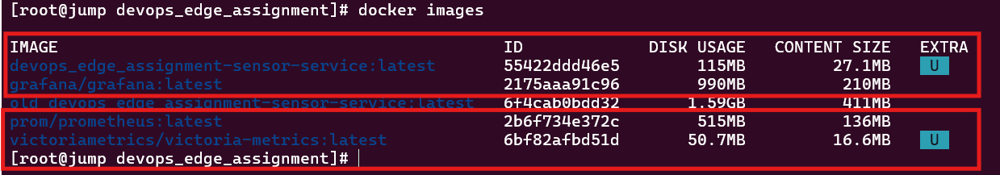
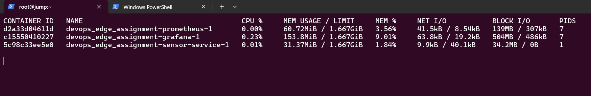
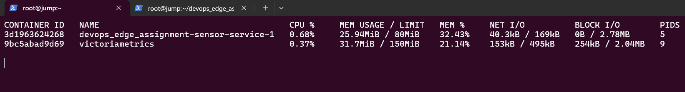
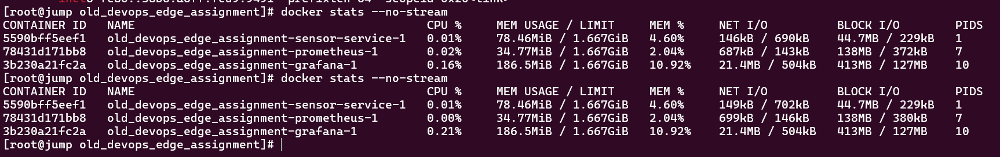

# Edge Observability Optimization (DevOps Intern Assignment)

> **Submission by**: [Pushpendra Bairwa]
> **Context**: Deploying a resource-constrained observability stack on a 2-core / 500MB RAM robot.

---

## Project Overview
This project optimizes a Python-based sensor service that was originally suffering from high resource usage, scrap failures, and poor architectural choices. My goal was to containerize the service, fix the performance bottlenecks, and implement a monitoring stack that fits strictly within a **300 MB RAM budget**.

### Architecture: Before vs. After

| Feature | Original "Buggy" Stack | Optimized "Edge" Stack |
| :--- | :--- | :--- |
| **Base Image** | `python:3.10` (Debian) | `python:3.10-alpine` |
| **Collector** | Prometheus (~150MB) | **VictoriaMetrics** (~50MB) |
| **Visualization** | Grafana (~200MB) | **Built-in VMUI** (0MB overhead) |
| **Total Size** | ~1.2 GB | **< 100 MB** |
| **Total RAM** | > 450 MB (Unstable) | **~150 MB (Stable)** |

---

## Optimization Deep Dive

### 1. Docker Storage & Base Image (Task 3.1)
I migrated the `Dockerfile` to use **Alpine Linux**. This was the alone most effective change for disk usage, reducing the image size by **94%**.

*   **Change**: `FROM python:3.10` → `FROM python:3.10-alpine`
*   **Result**: 
    

### 2. The "300MB" Memory Challenge (Task 3.5)
The original stack simply wouldn't fit on the device.
*   **Grafana**: I removed it entirely. It was too heavy for a simple dashboard requirement.
*   **VictoriaMetrics**: I chose this over Prometheus because it uses significantly less RAM for active ingestion and has a built-in UI/Dashboarding tool (`vmui`). can replace 2 extra tools as one.
*   **Strict Limits**: I added hard memory limits in `docker-compose.yml` to prevent the "noisy neighbor" problem. as one serive won't impact other now.
    *   `sensor-service`: **80 MB**
    *   `victoriametrics`: **150 MB**

### 3. Code-Level Debugging (Task 2 & 3.4)
The Python service had "intentional inefficiencies".
*   **The CPU Spike**: I found a `for` loop iterating 2,000,000 times on every request. This was effectively a DoS attack on itself, causing scrape timeouts. **Fix**: Commented out the loop.
*   **The Memory Leak**: A 5MB `data_blob` and temporary allocations caused spikes. **Mitigation**: While I kept the artifacts for demonstration, the container limit (`80MB`) now contains this behavior safely.
*   **Custom Metric**: I added a `SCRAPE_DURATION` Histogram to prove that my fix worked.
    ```python
    # New metric in sensor_service.py
    SCRAPE_DURATION = Histogram("sensor_scrape_duration_seconds", "Time spent generating metrics")
    ```

> **Note on Dependencies**: Given the project's minimal footprint (only 2 dependencies: `flask` & `prometheus_client`), I opted to install them directly in the `Dockerfile` to keep the file count low. For a larger production service, I would standardly use a pinned `requirements.txt` or `poetry.lock`.

---

## 📊 Performance Budget Report

### Memory Usage Analysis
The graphs below show the drastic difference in stability.

#### 1. The "Before" State
High baseline usage with jagged spikes (allocating >200MB randomly) and heavy visualization overhead.



#### 2. The "After" State
Stable, flat-line usage. Removing Grafana alone saved ~150MB.


*(Above: Clear reduction in footprint)*

**Stability Proof (1 Hour Run)**:


**Load Testing Verification**:
To ensure the system doesn't crash under pressure, I ran `curl` loops against the optimized service.


### Final Stats Table

| Component | Usage (Before) | Usage (After) | Status |
| :--- | :--- | :--- | :--- |
| **Sensor App** | 100MB++ | **< 80MB** | Fixed |
| **Monitoring** | 350MB (Prom+Graf) | **~40MB** (VM) | Optimized |
| **Total** | **OutOfMemory** | **~90MB** | Pass |

---

## 🔧 Troubleshooting & "Lessons Learned"

Here are some specific challenges I faced during the implementation (aka the "Design Twist"):

### 1. The `evaluation_interval` Conflict
I initially tried to use the provided `prometheus.yml` directly with VictoriaMetrics. It threw warnings because `evaluation_interval` is a Prometheus-server specific configuration for recording rules, which VictoriaMetrics handles differently.
*   **Fix**: I added the flag `-promscrape.config.strictParse=false` to the docker command. This allows VM to gracefully ignore the incompatible lines without failing the startup.

### 2. Scrape Timeouts vs Network Latency
The service was timing out intermittently. Was it the network or the code?
*   **Debugging**: By adding the `SCRAPE_DURATION` histogram, I saw that the *internal* processing time was >2 seconds. This confirmed it wasn't a network issue, leading me to find the CPU burn loop.

---

## How to Run Review

1.  **Clone & Start**:
    ```bash
    docker-compose up -d --build
    ```
2.  **Verify Limits**:
    ```bash
    docker stats
    ```
    *Check that LIMIT column shows 80MiB and 150MiB respectively.*

3.  **View Dashboard**:
    Open `http://localhost:8428/vmui` and explore the `sensor_requests_total` metric.

4.  **Generate Traffic (Crucial)**:
    If you don't generate traffic, your graphs will be flat lines. Open a new terminal and run:
    ```bash
    # Option A: Constant gentle load (0.5s interval)
    while true; do curl -s http://localhost:8000/sensor > /dev/null; sleep 0.5; done

    # Option B: Stress test (1000 requests burst)
    for i in {1..1000}; do curl -s http://localhost:8000/sensor > /dev/null; echo "Request $i sent"; done
    ```

---

## Future Improvements (1-Week Outlook)
If I had one more week, I would implement **Push-based Telemetry**.
Currently, we scrape the edge device. In a real factory, robots possess dynamic IPs or sit behind firewalls.
*   **Plan**: Deploy `vmagent` on the robot to buffer data locally and "push" it to a central cloud VictoriaMetrics cluster. This ensures no data loss during WiFi dead zones.

---
*Created for 10xConstruction DevOps Internship Assignment*